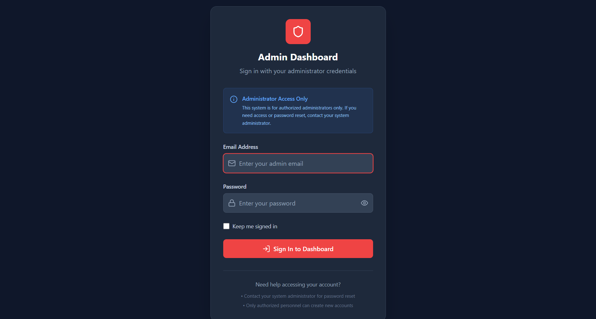
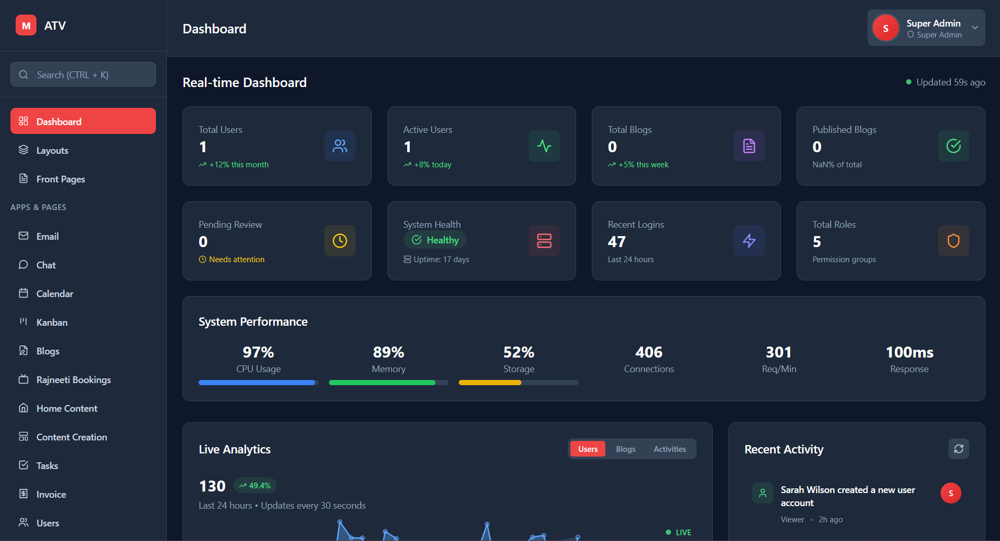
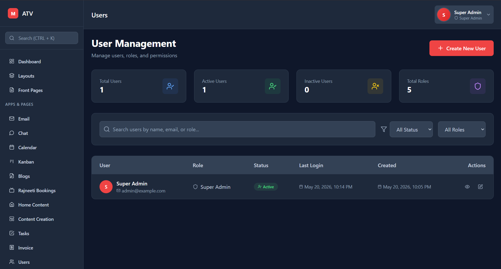
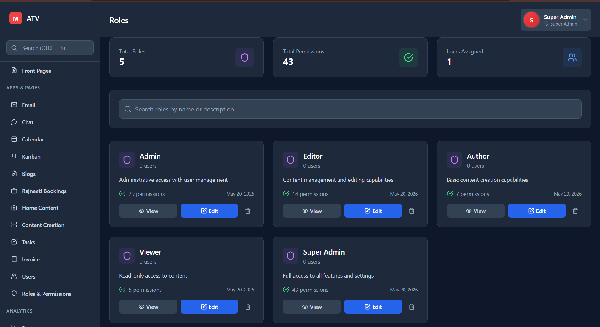
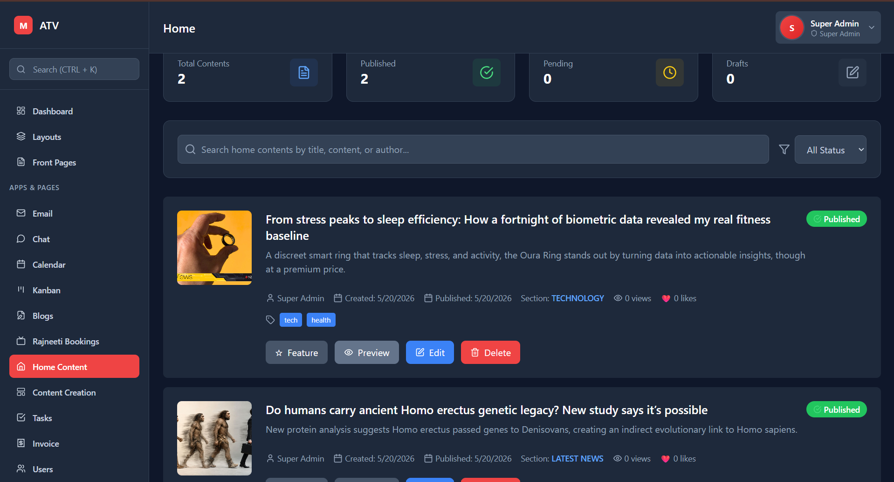
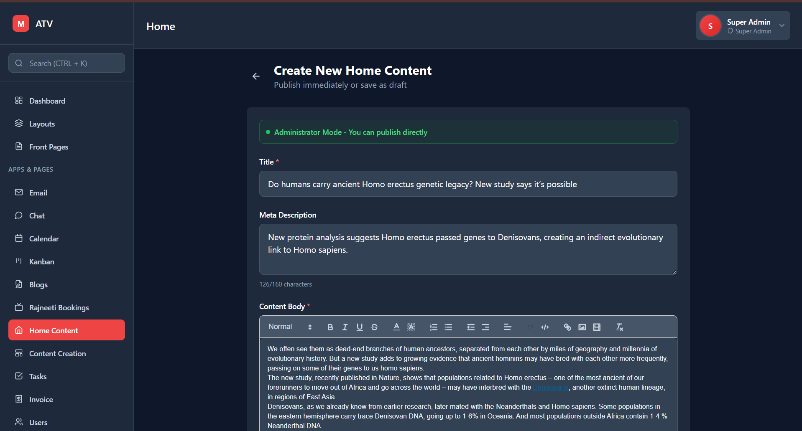
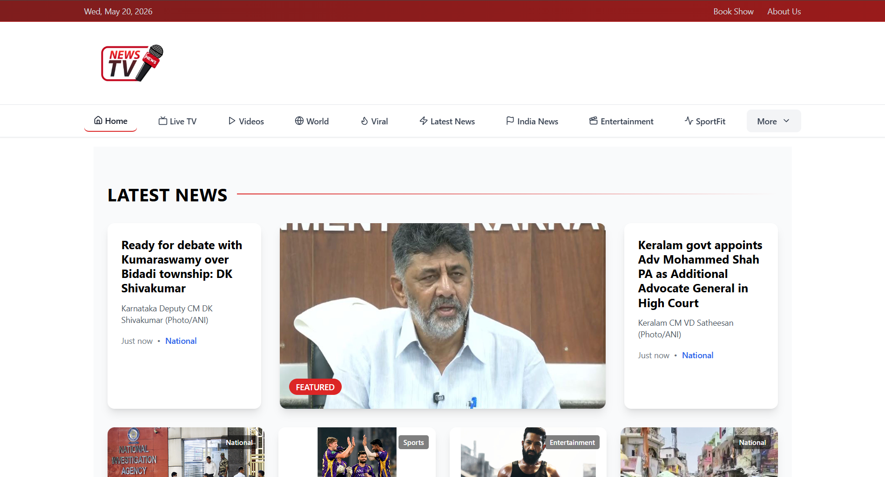

# Newsroom Ops Platform

Enterprise-grade newsroom management platform built for modern media operations.  
MATV Newsroom Platform enables administrators, editors, and content teams to manage publishing workflows, users, analytics, and newsroom operations from a centralized dashboard.

---

# 🚀 Features

## 🔐 Authentication & Security
- Secure administrator login system
- Role-Based Access Control (RBAC)
- Protected routes and middleware
- Permission-based feature access
- Security settings management
- Session handling

---

## 👥 User Management
- Create and manage newsroom users
- Assign roles and permissions
- Track user activity
- Active/inactive user monitoring
- User profile management

---

## 🛡️ Roles & Permissions
- Dynamic role creation
- Permission grouping
- Super Admin controls
- Editor & Author access management
- Granular route protection

---

## 📰 Content Management
- Create and publish news articles
- Rich text editor support
- Draft & publish workflows
- Category management
- Featured content support
- Search & filtering

---

## 📊 Dashboard & Analytics
- Real-time newsroom dashboard
- System health monitoring
- User activity tracking
- Publishing analytics
- Performance metrics
- Live statistics updates

---

## 💬 Internal Collaboration
- Editor communication system
- Real-time collaboration features
- Team workflow support

---

## 🌐 Public News Portal
- Responsive frontend news website
- Dynamic news rendering
- Featured stories
- Multi-category news display
- News modal previews

---

# 🛠️ Tech Stack

## Frontend
- Next.js
- React.js
- Tailwind CSS
- TypeScript

## Backend
- Node.js
- Express.js
- Prisma ORM

## Database
- MySQL

## Authentication & Security
- JWT Authentication
- RBAC Authorization

---

# 📂 Project Structure

```bash
MATV-Newsroom-Platform/
│
├── newsroom_cms/       # Admin Dashboard & CMS
├── news_site/          # Public News Website
├── images/             # README screenshots
│
├── README.md
└── LICENSE
```

---

# ⚙️ Installation & Setup

## 1️⃣ Clone the Repository

```bash
git clone https://github.com/your-username/matv-newsroom-platform.git
```

---

## 2️⃣ Navigate to CMS

```bash
cd newsroom_cms
```

---

## 3️⃣ Install Dependencies

```bash
npm install
```

---

## 4️⃣ Configure Environment Variables

Create a `.env` file inside the project root.

```env
DATABASE_URL="your_database_url"

JWT_SECRET="your_secret_key"

NEXT_PUBLIC_API_URL="http://localhost:5000"
```

---

## 5️⃣ Setup Database

```bash
npx prisma migrate dev
```

---

## 6️⃣ Start Development Server

```bash
npm run dev
```

---

# 🌐 Running Public News Site

## Navigate to Frontend

```bash
cd news_site
```

---

## Install Dependencies

```bash
npm install
```

---

## Start Frontend

```bash
npm run dev
```

---

# 🔑 Roles Available

| Role | Access Level |
|------|--------------|
| Super Admin | Full system access |
| Admin | Administrative controls |
| Editor | Content management |
| Author | Content creation |
| Viewer | Read-only access |

---

# 📸 Application Screenshots

---

## 🔐 Authentication System



---

## 📊 Real-Time Dashboard



---

## 👥 User Management



---

## 🛡️ Roles & Permissions (RBAC)



---

## 📰 Content Management



---

## ✍️ Editorial Content Creation



---

## 🌐 Public News Portal



---

## 📰 News Modal Preview


---

## 👤 Profile & Security Management

.png)

---

# 📈 Key Highlights

- Enterprise-style dashboard architecture
- Fully responsive UI
- Modular component structure
- RBAC implementation
- Real-time analytics
- Scalable backend structure
- Modern newsroom workflow system

---

# 🔮 Future Improvements

- Real-time notifications
- AI-powered article suggestions
- Advanced analytics dashboards
- Media upload optimization
- Live streaming integration
- Multi-language support
- WebSocket-based collaboration

---

# 📄 License

This project is licensed under the MIT License.

---

# 👨‍💻 Author

Developed by Sujan Vucha

GitHub: https://github.com/your-github-username

---

# ⭐ Support

If you found this project useful, consider giving it a ⭐ on GitHub.
